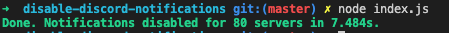

# Disable Discord Notifications

Script that disables notifications for each of your servers and sets them to "NOTHING".

## Installation

* Rename `config.sample.json` to `config.json` and fill it.
* Install dependencies using `yarn install --prod`
* Start the script using `node index.js`.
